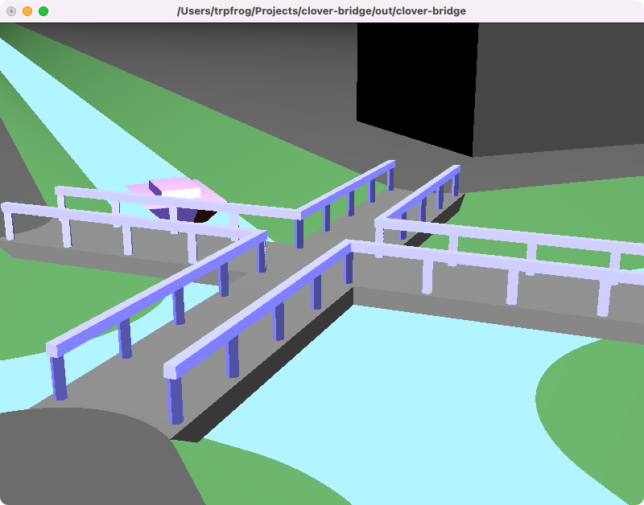

# clover-bridge



This is a repository of projects created in my university's OpenGL experiment.


## How to build

Run `run.sh` or enter following commands.

```
$ cmake .
$ cmake --build .
$ ./clover-bridge
```


## Key Binding

| Key           | Operation               |
| ------------- | ----------------------- |
| W / A / S / D | Move                    |
| J / K         | Rise / Fall             |
| I / O         | Zoom in/out             |
| Mouse drag    | Change your perspective |
| Middle click  | Reset your perspective  |


## Development Environment

- macOS Monterey 12.0.1
- CMake 3.22.0
- Apple clang version 13.0.0
